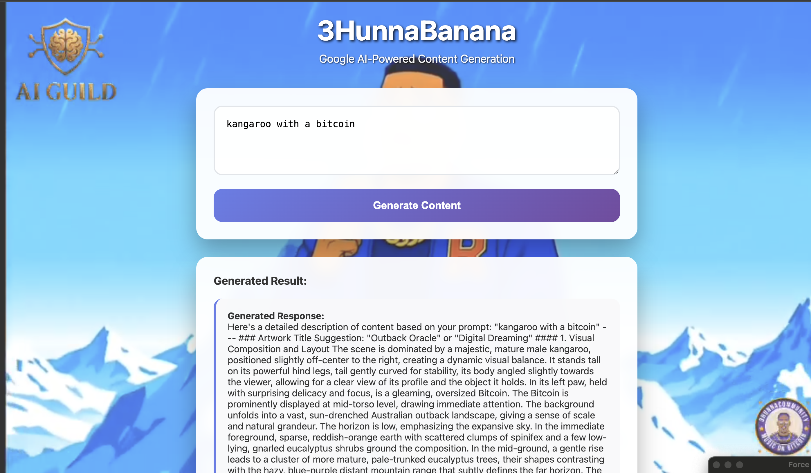

# 3HunnaBanana - AI Content Generator



A web application that leverages a Python Flask backend to serve a frontend that enables users to type in a prompt and get served detailed descriptions, generated images, AND videos through multiple AI services including Gemini AI, Hugging Face, and Google's Veo video generation.

## Features

- **Modern Web Interface**: Clean, responsive design optimized for mobile and desktop
- **AI-Powered Descriptions**: Uses Google's Gemini 2.5 Flash model to generate detailed content descriptions
- **Real Image Generation**: Generates actual images using Hugging Face's free Stable Diffusion API
- **Video Generation**: Creates videos using Google's Veo 3.0 API (same API key as Gemini)
- **Real-time Generation**: Instant responses with loading states and error handling
- **Beautiful UI**: Gradient backgrounds, smooth animations, and professional styling
- **Multi-Modal AI Services**: Combines Gemini for text, Stable Diffusion for images, and Veo for videos

## Setup

### Prerequisites

- Python 3.8+
- pip package manager

### Installation

1. **Clone the repository**:
   ```bash
   git clone <repository-url>
   cd 3HunnaBanana
   ```

2. **Install dependencies**:
   ```bash
   pip install -r requirements.txt
   ```

3. **Configure API Keys**:
   - **Gemini API**: Pre-configured with a working API key
   - **Hugging Face API**: Get a free token for image generation:
     1. Go to [https://huggingface.co/settings/tokens](https://huggingface.co/settings/tokens)
     2. Create a free account and get an access token
     3. Update `HUGGINGFACE_API_KEY` in `config.py`
   - **Veo Video API**: Uses the same Gemini API key automatically

4. **Run the application**:
   ```bash
   python3 app.py
   ```

5. **Open in browser**:
   Navigate to `http://localhost:5000`

## Usage

1. **Enter a prompt**: Describe the content you want to generate in the text area
2. **Click Generate**: The AI will create a detailed description, image (if configured), and video
3. **View Results**: Get comprehensive details, generated images, and video generation status

## API Endpoints

- `GET /` - Main web interface
- `POST /generate` - Generate content (description + image + video)
  - Request body: `{"prompt": "your content description"}`
  - Returns: Detailed description + generated image (if configured) + video status

## Technical Details

- **Backend**: Flask (Python)
- **Frontend**: HTML5, CSS3, JavaScript (ES6+)
- **AI Services**: 
  - Google Gemini 2.5 Flash (text generation)
  - Hugging Face Stable Diffusion (image generation)
  - Google Veo 3.0 (video generation)
- **Styling**: Custom CSS with responsive design
- **Architecture**: RESTful API with modern web interface

## Content Generation Setup

### Text Generation (Always Works)
- Uses pre-configured Gemini API key
- Generates detailed, artistic descriptions
- No additional setup required

### Image Generation (Optional)
1. **Get Hugging Face Token**:
   - Visit [https://huggingface.co/settings/tokens](https://huggingface.co/settings/tokens)
   - Create account and generate access token
   - Copy the token (starts with "hf_")

2. **Update Configuration**:
   ```python
   # In config.py
   HUGGINGFACE_API_KEY = "hf_your_actual_token_here"
   ```

### Video Generation (Automatic)
- Uses the same Gemini API key
- Generates videos using Google's Veo 3.0 model
- No additional setup required

## Project Structure

```
3HunnaBanana/
├── app.py              # Main Flask application
├── config.py           # Configuration and API keys
├── requirements.txt    # Python dependencies
├── templates/          # HTML templates
│   └── index.html     # Main page template
├── static/            # Static assets
│   ├── css/          # Stylesheets
│   │   └── style.css # Main styles
│   └── js/           # JavaScript files
│       └── script.js # Frontend logic
├── SETUP_IMAGES.md    # Image generation setup guide
└── readme.md          # This file
```

## Notes

- **Text Generation**: Always works with the pre-configured Gemini API
- **Image Generation**: Requires Hugging Face API token setup
- **Video Generation**: Automatically enabled with Gemini API key
- **Free Tier**: All services offer free tiers for development and testing
- **Content Quality**: 
  - Images: 512x512 pixels using Stable Diffusion v1.5
  - Videos: Generated using Google's latest Veo 3.0 model
  - Text: Rich, detailed descriptions optimized for creative use

## License

This project is open source and available under the MIT License.